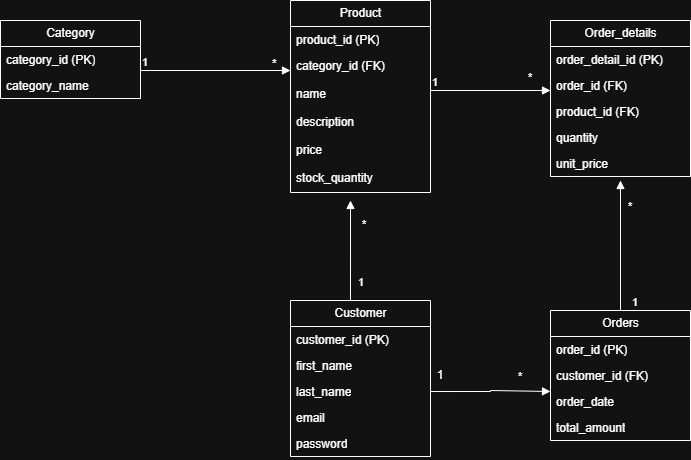

# Store Database Project

##  Overview

This project represents a database design for a simple store system.
It includes database schema creation, sample data insertion, and SQL queries for data analysis.

---

##  Database Schema

The system consists of the following tables:

* Category
* Product
* Customer
* Orders
* Order_details

---

##  Relationships

* A Category can have multiple Products (1:N)
* A Customer can have multiple Orders (1:N)
* An Order can have multiple Order_details (1:N)
* Each Product can appear in multiple Order_details (1:N)

---

##  ERD Diagram

---

##  Sample Data

Sample data is provided in the `data.sql` file.

---

##  SQL Queries

The project includes several queries such as:

* Daily revenue report
* Top-selling products per month
* Customers with total orders more than $500 in the last month

All queries are available in the `queries.sql` file.

---

##  Technologies Used

* SQL Server
* T-SQL

---

##  Notes

Denormalization techniques were applied to improve performance by reducing joins and storing frequently used and aggregated data.

---
